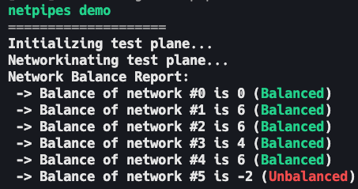

# Netpipes

> An operating system, a SIEM, and a Holy C IDE. It's a way of life, netpipes

Actual purpose

The purpose of netpipes is to simulate a 2D plane of items which can be networked together by being positioned directly adjacently in any direction (except diagonally).

Why? No clue. Random idea which helped me learn more C.

## Demo

Click to reveal

### Startup Banner and Network Balance Report

The program displays a startup banner, and then reports if there are any misbalances with any of the networks.

### Item Types Report

This report shows the item types at each position in the item plane.

### Network IDs Report

This report shows the network IDs of items at each position in the item plane.

### Adjacent Planes Report

This report shows item types alongside their network IDs at each position in the item plane. 

This view provides the convenience of the Item Types and Network IDs report being effectively merged.

## License

Copyright (c) 2024 Lachlan Adamson et al.

See [LICENSE][LICENSE] for more details.

## Translations

Braille Translation

### ⠝⠑⠞⠏⠊⠏⠑⠎

⠝⠑⠞⠏⠊⠏⠑⠎

#### ⠇⠊⠉⠑⠝⠉⠑

⠉⠕⠏⠽⠗⠊⠛⠓⠞ ⠉ ⠆⠴⠆⠲ ⠇⠁⠉⠓⠇⠁⠝ ⠁⠙⠁⠍⠎⠕⠝

⠎⠑⠑ [⠇⠊⠉⠑⠝⠉⠑⠍⠙][LICENSE] ⠋⠕⠗ ⠍⠕⠗⠑ ⠙⠑⠞⠁⠊⠇⠎

Hexadecimal Translation

### 4E65747069706573

4E657470697065732E

#### 4C6963656E7365

436f70797269676874202863292032303234204c6163686c616e204164616d736f6e

536565 [4c4943454e53452e6d64][LICENSE] 666f72206d6f72652064657461696c732e

[LICENSE]: LICENSE.md
